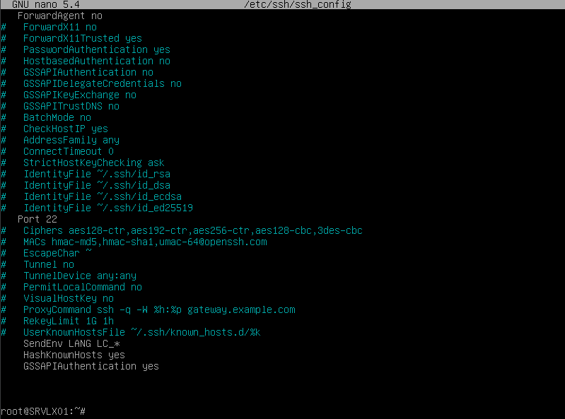

```red
Partie 1 : Gestion des utilisateurs
```

** Q 2.1.1 **


** Q 2.1.2**

Je préconise le droit minimun à raport à son usage.

```red
Partie 2 : Configuration de SSH
```

** Q 2.2.1 **



** Q 2.2.2 **

** Q 2.2.3 **

```
Partie 3 : Analyse du stockage
```

** Q 2.3.1 **
j'ai trouvé comme systéme de fichier du EXT4, EXT2 , TMPFS et du devtmpfs.
